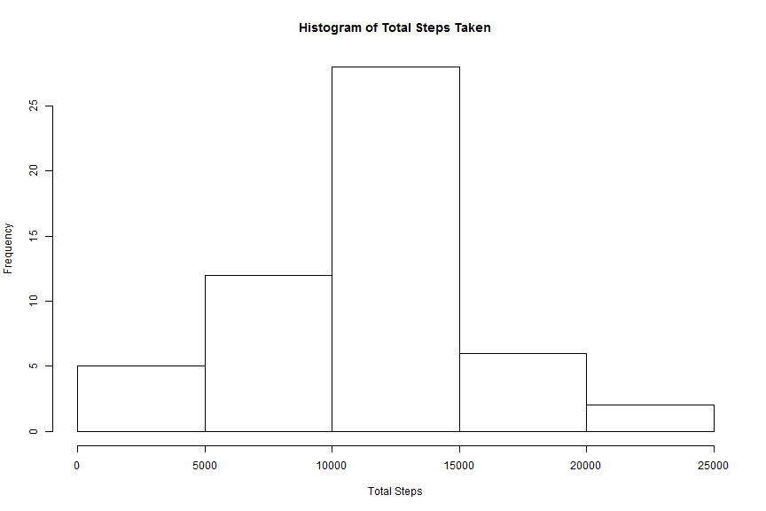
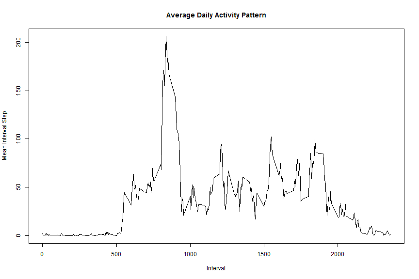
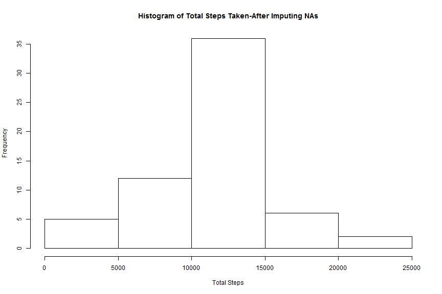
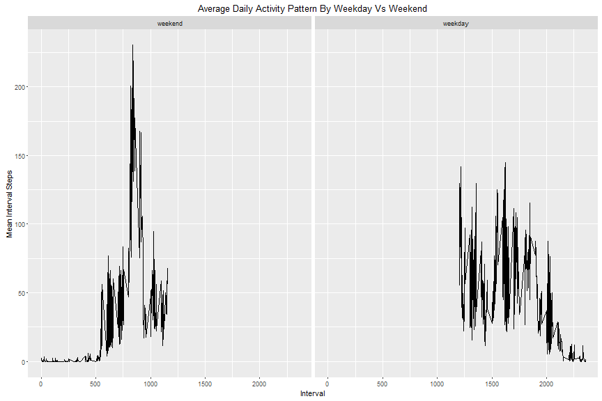

```r
---
title: "Assignment"
output: html_document
---
Lets set some global options 
```

```
## Error: <text>:5:6: unexpected symbol
## 4: ---
## 5: Lets set
##         ^
```

```r
library(knitr)
opts_chunk$set(fig.width=12, fig.height=8, fig.path='Figs/',
                      echo=TRUE, warning=FALSE, message=FALSE)
library(knitr)
```

## Loading and preprocessing the data

1)Code for reading in the dataset and/or processing the data


```r
library(dplyr)
library(ggplot2)
x<-read.csv("activity.csv",header = TRUE,na.strings = "NA",stringsAsFactors = TRUE)
x$date<-as.Date(x$date,"%Y-%m-%d")
#Getting complete cases by removing NAs
x_complete<-na.omit(x)
```
##What is mean total number of steps taken per day?

1)Histogram of the total number of steps taken each day


```r
#Compute datewise total steps
x1<-x_complete %>% group_by(date) %>% summarise(totalStep = sum(steps))
#plot histogram
hist(x1$totalStep,xlab = "Total Steps",main = "Histogram of Total Steps Taken")
```



2)Mean and median number of steps taken each day


```r
#Compute mean and median of steps taken per day
x_complete %>% group_by(date) %>% summarise(totalStep = sum(steps)) %>% summarise(mean=mean(totalStep),median=median(totalStep))
```

```
## Source: local data frame [1 x 2]
## 
##       mean median
##      (dbl)  (int)
## 1 10766.19  10765
```
##What is the average daily activity pattern?

1)Time series plot of the average number of steps taken


```r
x2<-x_complete %>% group_by(interval) %>% summarise(totalStep = sum(steps),mean=mean(steps)) 
with(x2,plot(interval,mean,type  ="l",xlab = "Interval",ylab = "Mean Interval Step",main = "Average Daily Activity Pattern"))
```


2) The 5-minute interval that, on average, contains the maximum number of steps


```r
max<-x2[which.max(x2$mean),1]
```
The 5-minute interval that, on average, contains the maximum number of steps is 835

## Imputing missing values

1) Code to describe and show a strategy for imputing missing data.Missing Values are imputed with mean interval steps.


```r
naCount<-sum(is.na(x))
Index<-which(is.na(x))
xImputed<-x
x4<-x_complete %>% group_by(interval) %>% summarise(totalStep = sum(steps),mean=mean(steps)) 
#Missing values are imputed with mean interval steps.        
for(i in 1:length(Index)) {
        xImputed$steps[Index[i]]<-filter(x4,interval %in%    xImputed$interval[Index[i]])[[3]]}
```
Number of raws with NA is 2304

2) Histogram of the total number of steps taken each day after missing values are imputed

Following code computes mean and media of steps taken each day after imputing missing values.  


```r
#Compute mean and median of steps taken each day after imputing missing values
xImputed %>% group_by(date) %>% summarise(totalStep = sum(steps)) %>% 
        summarise(mean=mean(totalStep),median=median(totalStep))
```

```
## Source: local data frame [1 x 2]
## 
##       mean   median
##      (dbl)    (dbl)
## 1 10766.19 10766.19
```


```r
#plot histogram 
x5<-xImputed %>% group_by(date) %>% summarise(totalStep = sum(steps))
hist(x5$totalStep,xlab = "Total Steps",main = "Histogram of Total Steps Taken-After Imputing NAs")
```



##Are there differences in activity patterns between weekdays and weekends?

1)Panel plot comparing the average number of steps taken per 5-minute interval across weekdays and weekends

Following code chuk create a factor variable dayType with two levels ('weekend', 'weekday') and compute mean interval steps by dayType.  


```r
weekdays1 <- c('Monday', 'Tuesday', 'Wednesday', 'Thursday', 'Friday')
xImputed$dayType <- factor((weekdays(xImputed$date) %in% weekdays1), 
                   levels=c(FALSE, TRUE), labels=c('weekend', 'weekday')) 
x6<-xImputed %>% group_by(interval,dayType) %>% summarise(totalStep = sum(steps),mean=mean(steps)) 
```
Following plot chunk draw the panel plot.

```r
g<-with(x6,qplot(interval,mean,facets = .~dayType,geom = "line"))
g+labs(x="Interval")+labs (y ="Mean Interval Steps")+labs(title = "Average Daily Activity Pattern By Weekday Vs Weekend")
```


Looking at the plot, Its clear that mean interval step is more scattered across intervals during weekends than during weekdays.It can also be noted that mean steps is zero after interval 1250(approx) on weekends while there are some activity till interval 2500(Approx) on Weekdays.
```

